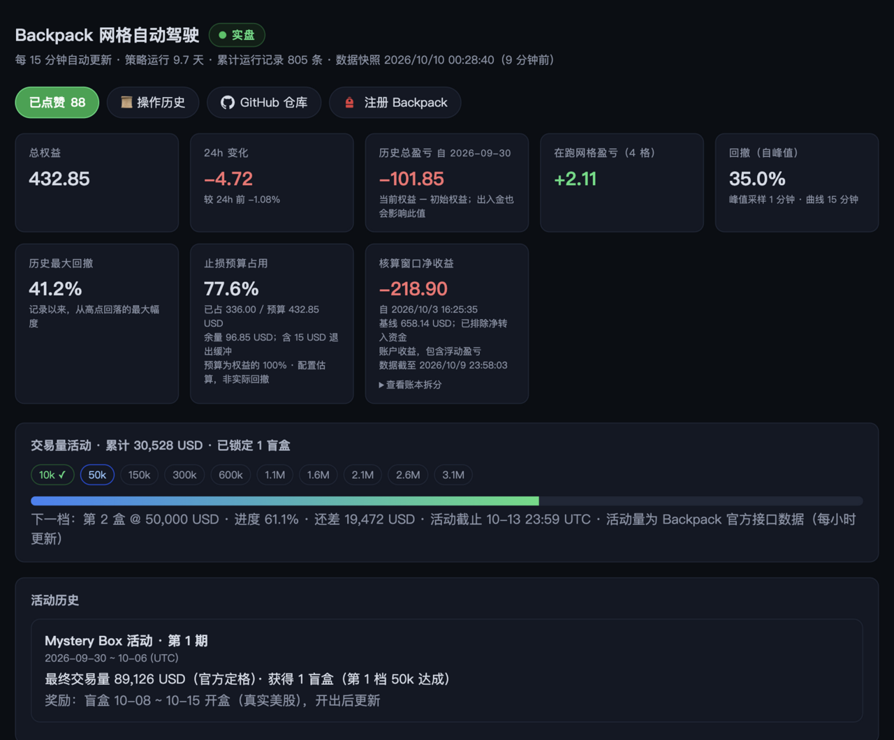

# Backpack 网格自动巡检

**[中文](README.zh-CN.md) | [English](README.md)**

自动化管理 Backpack 合约网格：自动分析适合网格的币种、止盈止损换仓、同时最多 4 个中性网格，附带交易量活动进度追踪与线上状态仪表盘。本机 launchd 每 15 分钟自动执行一轮，人工零干预；所有操作走 Backpack 网页会话鉴权接口（复用 ego lite 浏览器登录态），不使用任何 API key。

## 🔴 实盘运行中

这不是回测或模拟盘——策略以真实资金（4 个中性网格）持续运行在 Backpack 永续市场，
下方截图即线上仪表盘的实时画面（权益、网格盈亏、活动进度每 15 分钟自动更新）：

<p align="center">
  <a href="https://grid.terryso.dev">
    
  </a>
</p>

🔗 **[打开实时仪表盘](https://grid.terryso.dev)**（公开只读，无需登录/密钥；数据上传通道独立密钥保护）

> ⚠️ 本项目为个人实盘实验记录，不构成投资建议。加密合约交易风险极高，据此操作后果自负。

## 常用命令

```bash
bash scripts/run_round.sh            # 手动跑一轮完整巡检（入口自锁，与定时轮互斥）
DRYRUN=1 bash scripts/run_round.sh   # 只观察+判定，不动手（同样持锁）
node scripts/analyze.cjs             # 单独看选币排名 Top10
node tests/regression.cjs            # 回归测试（106 用例，~10 秒）
bash scripts/upload_dashboard.sh     # 手动刷新线上仪表盘数据
```

定时执行由本机 launchd 承担（`~/Library/LaunchAgents/com.backpack-grid-monitor.plist`，每 15 分钟）：
`launchctl kickstart gui/$(id -u)/com.backpack.grid-monitor` 可立即触发一轮。

## 每轮巡检做什么

```
observe   4 个会话鉴权 API：网格账本 / 持仓 / 权益 / 账户（~5 秒，数据完整性 fail-loud）
decide    风控闸门（熔断/pending/保护对账）→ 逐格规则（止盈/止损/出界/强平距离）
          → 有风险退出：立即执行，补仓推迟到 phase 2；无风险退出：直接规划补仓
act       风险退出先行执行（停止网格→等仓位平掉→删除），然后校验式创建新网格
复核      重新观察并把快照推送到线上仪表盘（best-effort）
```

安全原则：**任何数据不完整、校验失败、状态未知，一律不动手**并报错/通知；
风险退出永远优先于开新仓；所有写操作前先持久化意图（write-ahead），失败可恢复。

## 换仓规则（config.json）

| 参数 | 当前值 | 说明 |
|---|---|---|
| `takeProfitPct` | 10 | 网格盈亏（含资金费，相对投入资金）≥ +10% → 止盈换仓 |
| `stopLossPct` | 6 | ≤ -6% → 止损换仓；同时是交易所侧原生止损值 |
| `exitBufferPct` | 1 | 价格离开网格区间 1% → 轮换 |
| `liqDangerPct` | 12 | 标记价距强平价 <12% → 紧急换仓 |
| `maxGrids` / `gridValueUsd` | 4 / 2500 | 最多 4 个中性网格，每格名义 2,500 USD |
| `riskBudgetPct` / `warnDrawdownPct` | 80 / 40 | 组合止损额度预算；账户回撤熔断线 / 预警线 |
| `minScore` / `minQvol24h` | 5 / 800,000 | 选币及格线与流动性门槛，不达标宁可空仓 |
| `maxPerEcosystem` | 2 | 同生态（Solana 系等，见 `ecosystems` 表）最多 2 格 |

所有百分比口径 =（网格账本盈亏 + 累计资金费）÷ 投入资金。触发后流程：
停止网格 → 等机器人仓位市价平掉（硬闸，不平不删）→ 删除 → 重新分析 → 创建新网格
（创建时即写入原生保护）→ 验证订单挂出 → 复核。

## 风控分层

1. **交易所侧兜底**：每个网格都带原生 `TP=10 / SL=6 / closePositionsOnStop`，即使本机休眠也会触发；创建时写入并读回核验，巡检每轮对账、缺失自动回补（protect），自愈失败自动紧急清理该网格
2. **账户风险预算**：开新格前检查 `Σ存量(投入×实际SL%) + 新格额度 + 缓冲 ≤ 权益×80%`；回撤 ≥40% 禁止新开仓，≥80% 熔断全停并锁死（需人工清 `state/risk.json` 的 `paused`，保留 `peakEquity`）
3. **pendingStop 账本**：平仓超时/删除失败/意图未知全部记账，下轮强制重试清理，清理未完成期间禁止新开仓；手动暂停的网格（Disabled 且盈亏未越阈值）不会被触碰
4. **fail-safe**：数据缺失/畸形按"未知"处理（fail-loud），行情故障只跳过价格类规则，零网格是合法状态
5. **缩容补位**：风险预算不够标准格时自动降档（2500→1950→…，50 的倍数、下限 500），空位以合规小规模回补而非空置
6. **峰值细粒度采样**：独立 launchd 任务每 60 秒轻量探测权益，棘轮更新峰值（巡检轮次进行中自动避让）——回撤指标的采样粒度从 15 分钟提升到 1 分钟

## 选币逻辑（scripts/analyze.cjs）

拉取全部 USDC 加密永续的 24h/72h/7d K 线，评分 = 震荡度（chop = 价格路径÷净漂移，
24h+72h 双窗平均、上限 20 截尾）× 流动性 − 趋势惩罚 − 资金费惩罚。
过滤：24h 成交量 < `minQvol24h`、美股类合约、已持有市场；评分 < `minScore` 宁可空仓。
网格区间基于近期振幅（6%~30%），格距按震荡路径自适应（0.35%~0.8%），
按交易所 tickSize/minQuantity 取整。另输出"方向性候选"仅供纸上跟踪（不实盘）。

## 交易量活动追踪（Mystery Box）

活动窗口 2026-09-30 ~ 10-06（campaignId 1011）：累计交易量 50k→1 盒、300k→2 盒、
之后每 500k 一盒、封顶 4.1M/10 盒。原生网格机器人成交计入（官方排除 API 交易/强平等）。
巡检以成交历史全量为基线、账本增量逐轮累计（容忍网格重建导致的账本重置），
每轮日志与仪表盘输出 `X / 50,000` 进度。追踪状态在 `state/campaign.json`。

## 状态仪表盘（Cloudflare Worker + KV）

巡检每轮退出时 best-effort 上传快照（失败不影响巡检）。线上页面展示权益卡片、
活动进度条、网格卡片、权益曲线、风控/待清理/最近动作状态，60 秒自刷新，移动端适配。

- 地址：`DASH_URL`（`state/dashboard.env`）；读取公开，无需密钥
- 上传凭证：`DASH_WRITE_TOKEN`（同文件，仅本机持有；泄露即重建并重设 Worker secret）
- 手动刷新数据：`bash scripts/upload_dashboard.sh`
- 重新部署：`PATH=~/.nvm/versions/node/v22.14.0/bin:$PATH bash scripts/deploy_dashboard.sh`（需 wrangler OAuth 登录，本机已有）

## 测试

```bash
node tests/regression.cjs   # 107 用例，~10 秒，零真实网络
```

两层：Layer A 纯逻辑复刻 + 源码金丝雀；Layer B **执行生产源码**——decide.cjs 以
`BG_ROOT` 沙箱 fixture 跑真实流程，act_core.cjs 的 stopGrid 以 mock io 直接执行。
decide 另支持 `BG_TICKERS_FILE`（确定性免网络行情）。改完代码必须全绿再提交。

## 文件清单

```
scripts/   run_round.sh（编排+内核flock自锁） with_lock.py（统一锁包装） risk_write.py（risk.json唯一写通道）
           observe.mjs decide.cjs act.mjs act_core.cjs peak_probe.mjs
           analyze.cjs api.cjs dashboard_data.cjs upload/deploy_dashboard.sh
cloudflare/ worker.js + dashboard.html + wrangler.toml（仪表盘 Worker）
tests/     regression.cjs（回归套件）
config.json 全部策略参数
state/     运行时数据（gitignored）：observed/actions/act_results/pending_stops/
           risk/campaign/equity_curve.jsonl/log.md/dashboard.env(密钥)/lock
```

`state/equity_curve.jsonl` 每轮一行权益/盈亏/活动量/回撤记录，是复盘与回测的数据基础。

## 运维手册

| 情况 | 处理 |
|---|---|
| 暂停自动巡检 | 卸载 launchd：`launchctl bootout gui/$(id -u)/com.backpack.grid-monitor`（网格在交易所侧继续运行，原生兜底仍在） |
| 改参数 | 编辑 `config.json`，下一轮生效；改 SL/TP 后对账层会自动把交易所侧拉齐 |
| OBSERVE_FAILED | 多为浏览器登录态失效或数据不完整（fail-loud），重新登录 ego lite 的 Backpack 后下一轮自愈 |
| ACT_FAILED | 读 `state/act_results.json` 定位；`pending_stops.json` 非空表示有未完成清理，下轮自动重试 |
| 熔断恢复 | 修复 `state/risk.json`：保留 `peakEquity`、删除 `paused` 字段 |
| 手动暂停某网格 | 直接在交易所侧关闭即可——巡检识别"Disabled 且盈亏未越阈值"不会动它；**注意**若盈亏已越过阈值会被视为兜底触发而轮换 |
| 仪表盘 403 | `state/dashboard.env` 的 DASH_TOKEN 与 Worker secret 不一致，重跑 deploy |

## 已知引擎 quirk

- 同币种"删除后立刻重建"会 enabled 但不铺单；act 创建后验证订单数，不足自动停/启踢活
- 网格限价单也可能 taker 成交（实测 maker 占比 ~97%）；账户费率 4 级 maker 0.016%，
  格距 0.35%+ 相对最坏往返成本 ~0.07% 仍有充足毛利

## AI 运维 Skill

`skills/backpack-grid-ops/SKILL.md`（skills.sh 规范布局）封装了本项目的
全部运维操作：启动/停止定时巡检、部署仪表盘、跑巡检与测试、故障处理表。AI 会话中
可直接调用；修改后无需重新安装（符号链接实时生效）。agent 目录接线为本机操作（`.zcode/` 已 gitignore）：
`mkdir -p .zcode/skills && ln -sfn ../../skills/backpack-grid-ops .zcode/skills/backpack-grid-ops`
及用户级 `ln -sfn $(pwd)/skills/backpack-grid-ops ~/.agents/skills/backpack-grid-ops`。

## 安全

无 API key、无私钥；交易所操作依赖 ego lite 浏览器会话。全部密钥（仪表盘
DASH_TOKEN 等）只存 `state/dashboard.env`，`state/` 整体被 gitignore，仓库可安全推送。

## 2026-10-03 执行与数据契约

- Python 固定 `/Users/nick/.browser-use-env/bin/python3`；开发测试使用 Node 22，运行 `npm ci && npm test`。测试禁止网络、直接执行生产核心和完整 act／runner 的模拟 I/O。
- `risk_write.py` 是唯一风险状态写入通道；失败禁开仓，未落盘熔断由 risk_write_pending.json 重放，已有 paused 不自动清除。
- history／research 为独立定时任务；手续费按原始成交 ID 去重并报告覆盖范围，未知资金费不按零打分。
- `run_events.jsonl` 记录确认事件，旧计划日志不再作为实盘换仓次数；权益变化不直接称作策略收益。完整归因需精确基线时间及核对过的现金流等导出，导入说明见 docs/project-review-2026-10-02.md。
- 首页由 Workers Static Assets 提供；API 免费额度耗尽时显示注明时间的部署快照，动态接口需额度重置后恢复。上传成功后会读回确认，运输结果记录 dashboard_upload.json。
- 可复现的任务配置：`/Users/nick/.browser-use-env/bin/python3 scripts/install_launch_agents.py --install`，仅写 plist，不会启动服务；RunAtLoad=false。
- 详细完成／待验收状态：[修复与验收文档](docs/project-review-2026-10-02.md)。
